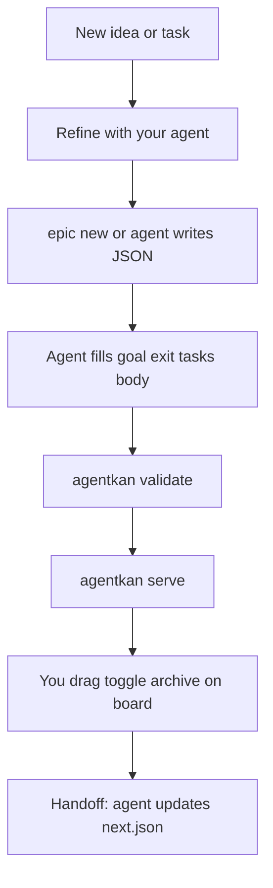

# How it works

Practical guide for using agentkan day to day. Install and CLI flags: [getting started](getting-started.md). Agent editing rules: [skill & AI workflow](skill.md).

## Mental model

| File | Owns |
|------|------|
| `roadmap.json` | State: phases, releases, epics, tasks, status columns |
| `epics/<ID>.md` | Prose: context, reasoning, how (agents read this) |
| `next.json` | Pointer: single next action, critical path, blockers |
| `archive.json` | Finished epics off the live board |
| `board.tokens.json` | Theme colors and emoji vocabulary for labels/assignees/statuses |
| `index.html` | Viewer: drag, edit meta, toggle tasks, archive |

JSON is source of truth for **status**. Markdown is source of truth for **how**. Epics sort by **id** in the viewer. There is no `roadmap.md`.

## Three surfaces

| Surface | Role |
|---------|------|
| **Your agent** (`SKILLS/agentkan/SKILL.md`) | Shape work: refine ideas, fill epics, add tasks, edit JSON |
| **CLI** | Fast epic stubs (`epic new`) |
| **Board** (`agentkan serve`) | Operate: drag cards, toggle tasks, archive |

The board does not create epics or tasks. Creation is via the CLI or your agent.

## Daily loop



## Scenarios

### New feature idea

1. Talk through the idea with your agent ("shape this as an agentkan epic").
2. Create a stub:

   ```bash
   npx agentkan epic new "Billing integration" \
     --phase P1 \
     --release v1 \
     --assignee ai+verify \
     --labels backend,api
   ```

   Defaults to the phase with `status: "active"` if you omit `--phase`. Epic IDs follow the phase: `P2` gets `E2.1`, `E2.2`, etc.

3. Agent fills `goal`, `exit`, `tasks` in `roadmap.json` and the matching `epics/<ID>.md` (interview flow in [skill.md](skill.md)).
4. Run `npx agentkan validate docs/board`.
5. Open the board, drag the card when you are ready to prioritize.

You can skip the CLI and have the agent write the epic directly into `roadmap.json`, but `epic new` auto-assigns the next ID and creates the markdown stub.

### Daily work

Run `npx agentkan serve`, then work the **Board** (drag cards between columns, open a card to edit fields and add/rename/toggle tasks) or the **Timeline** (the roadmap by phase, with a "you are here" marker). Edit **Up next** from the sidebar, filter by assignee, focus by phase or release (stepper/rail), and switch light/dark with the ☀/🌙 toggle. A served board saves automatically. You own moving epics to Done and archiving. See [viewer](viewer.md).

### Add tasks under an epic

There is no `agentkan task new` command. Add tasks in `roadmap.json` (usually via your agent):

```jsonc
{
  "id": "E1.5-T3",
  "title": "Stripe webhook handler",
  "status": "todo",
  "assignee": "ai",
  "labels": ["api"],
  "planned": null
}
```

Rules:

- Task id = `<EPIC>-T<n>` (e.g. `E1.5-T3`).
- Task id must belong to its parent epic.
- Status: `todo` | `doing` | `done`.

On the board, click the epic card and cycle each task (todo → doing → done). The drawer does not add new tasks.

Mirror detail in `epics/<ID>.md` if agents need prose context.

### Create or link epics to a business phase

Phases live in `roadmap.json` and group execution work. **Releases** (optional)
define shippable product scope:

```jsonc
"releases": [
  { "id": "v1", "title": "MVP", "status": "active", "goal": "...", "exit": "..." }
],
"phases": [
  {
    "id": "P2",
    "title": "Growth",
    "emoji": "🌱",
    "status": "planned",
    "release": "v1",
    "goal": "Features that bring users back.",
    "exit": "Weekly retention is measurable.",
    "epics": []
  }
]
```

Two phases can share one release (`P1` and `P2` both `"release": "v1"`).
Epic IDs stay stable (`E1.26`); they are not renamed per release.

There is no `phase new` or `release new` CLI. Add phases and releases by editing
JSON or asking your agent. Attach epics with `epic new --phase P2 --release v1`
or by appending to `phases[n].epics`.

Convention: one phase is usually `active` at a time. That is not enforced by code.

### New labels

**Vocabulary** (emoji on cards) in `board.tokens.json`:

```json
"labels": {
  "payments": "💳",
  "api": "🔌"
}
```

**Use on cards** via CLI (`--labels payments,api`), the viewer drawer (comma-separated), or agent edits.

Unknown labels validate with a warning and render without an emoji. Add real vocabulary to `board.tokens.json` when a label is here to stay.

### End of session (handoff)

Say "handoff" or "wrap up". Your agent should:

1. Run the skill's `status.sh` for a git snapshot and current `next.json`.
2. Set task and epic statuses to match reality.
3. Refresh `next.json` (`next`, `criticalPath`, `risks`).
4. Bump `updated` dates if it edited JSON directly.
5. Run `agentkan validate` and summarize briefly.
6. Optionally ask to write a session log under `docs/sessions/`.

Agents must not mark an epic `done` or archive unless you ask in that turn. That is your job on the board.

### New project

`npx agentkan init` scaffolds `docs/board/` with JSON, viewer, schema, and `epics/`. No `roadmap.md`.

## What is configurable

| Thing | Where | CLI | Board UI |
|-------|--------|-----|----------|
| Theme colors | `board.tokens.json` → `theme` | — | auto |
| Label/assignee/status emoji | `board.tokens.json` | — | auto |
| New label vocabulary | `board.tokens.json` | — | legend / drawer |
| New release | `roadmap.json` | no | release rail |
| New epic stub | `roadmap.json` + `epics/*.md` | `epic new` | no |
| New task | `roadmap.json` | no | toggle only |
| New phase | `roadmap.json` | no | no |
| Epic status / column | `roadmap.json` | — | drag + drawer |
| Epic display order | viewer | — | by epic id within column/lane |
| Archive | `archive.json` | — | drawer |
| Next action pointer | `next.json` | — | read-only banner |
| Assignee/status enums | schema + validator | fixed: `ai`, `me`, `ai+verify` | dropdown from tokens |

Re-skinning never requires editing `index.html`.

## Commands

```bash
npx agentkan init [dir]              # scaffold docs/board/
npx agentkan epic new "<title>" ...  # epic stub + epics/<ID>.md
npx agentkan serve [dir]             # localhost board (read-write)
npx agentkan validate [dir]          # schema gate
```

Full `epic new` flags: [getting started](getting-started.md).

Field shapes: [data model](data-model.md).
